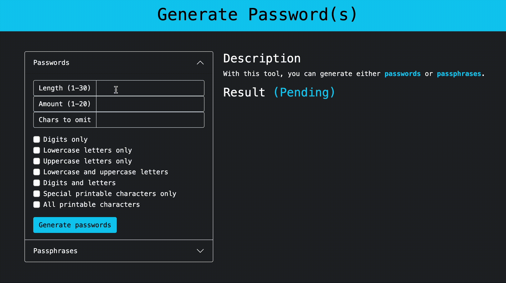
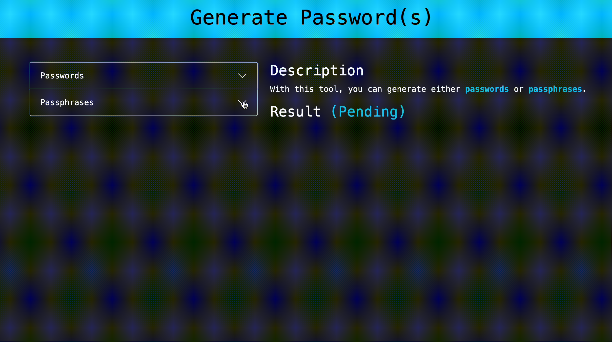

# Password Generator

## Description

A web app to generate password(s) or passphrase(s) based on user preferences. The strength of the generated passwords is evaluated by calculating their entropy based on the formula $E = \log_2(C^L)$ [[1]](#references).

- ****Front-end****: Client side UI
- ****Back-end****: Server side APIs have the format of `/api/v1/character_type/password_length/amount_to_be_generated`. Note that `character_type` and `password_length` are required, whereas `amount_to_be_generated` is optional and defaults to 1.
- ****Tech Stack****: HTML, CSS, Bootstrap, JavaScript, Python, Flask

## Demo





## Local Installation & How to Use

One time set up for virtual environment:
```console
$ python3.10 -m venv .venv
$ source .venv/bin/activate
$ python -m pip install -U pip
$ python -m pip install -r utilities/requirements.txt
$ deactivate
```

Start the server:
```console
$ cd server
$ flask run
```

Start the client:
```console
$ cd client
$ python -m http.server 
```

## Server Side API Examples
- /api/v1/digits/10/
- /api/v1/digits/10/20
- /api/v1/digits/10/20?omit=123
- /api/v1/lower/10/
- /api/v1/lower/10/20
- /api/v1/lower/10/20?omit=abc
- /api/v1/upper/10/
- /api/v1/upper/10/20
- /api/v1/upper/10/20?omit=ABC
- /api/v1/letters/10/
- /api/v1/letters/10/20
- /api/v1/letters/10/20?omit=abcABC
- /api/v1/alphanum/10/
- /api/v1/alphanum/10/20
- /api/v1/alphanum/10/20?omit=123abcABC
- /api/v1/special/10/
- /api/v1/special/10/20
- /api/v1/special/10/20?omit=$%#^*
- /api/v1/all/10/
- /api/v1/all/10/20
- /api/v1/all/10/20?omit=$%#^*123abcABC
- /api/v1/words/5/
- /api/v1/words/5/20
- /api/v1/words/5/20?separator=@$%

## References

[1] [Okta | Password Entropy: The Value of Unpredictable Passwords](https://www.okta.com/identity-101/password-entropy/)

## License

[MIT License](LICENSE)
